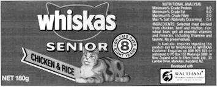
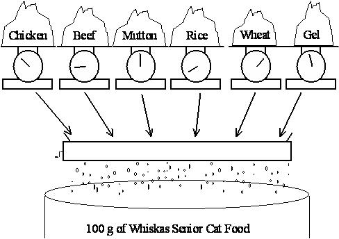

# 混合問題 (A Blending Problem)

## Problem Description



上に示したウィスカス (Whiskas) のキャットフードは、アンクル・ベンズ (Uncle Ben's) によって製造されています。アンクル・ベンズは、缶に記載されている栄養成分分析の要件を満たしつつ、可能な限り安価にキャットフード製品を製造したいと考えています。そのため、使用する各原材料（主原料は鶏肉、牛肉、羊肉、米、小麦、ジェル）の量を変化させながら、栄養基準を満たすことを目指しています。



鶏肉、牛肉、羊肉のコストはそれぞれ $\$0.013$、$\$0.008$、$\$0.010$ であり、米、小麦、ジェルのコストはそれぞれ $\$0.002$、$\$0.005$、$\$0.001$ です。（すべてのコストは 1 グラムあたりのものです）。この練習問題では、ビタミンやミネラル成分は無視します。（いずれにせよ、これらのコストは非常に小さいと考えられます）。

各原材料は、最終製品のタンパク質、脂肪、繊維、塩分の総重量に寄与します。1 グラムの原材料あたりの寄与（グラム単位）は以下の表の通りです。

| 原材料 (Stuff) | タンパク質 | 脂肪 | 繊維 | 塩分 |
| :--- | :--- | :--- | :--- | :--- |
| **鶏肉 (Chicken)** | 0.100 | 0.080 | 0.001 | 0.002 |
| **牛肉 (Beef)** | 0.200 | 0.100 | 0.005 | 0.005 |
| **羊肉 (Mutton)** | 0.150 | 0.110 | 0.003 | 0.007 |
| **米 (Rice)** | 0.000 | 0.010 | 0.100 | 0.002 |
| **小麦ふすま (Wheat bran)** | 0.040 | 0.010 | 0.150 | 0.008 |
| **ジェル (Gel)** | 0.000 | 0.000 | 0.000 | 0.000 |

---

## 簡略化された問題の定式化 (Simplified Formulation)

最初に、シンプルな Python モデルを構築するために簡略化された問題を検討します。

### 決定変数の特定 (Identify the Decision Variables)
ウィスカスが鶏肉と牛肉の 2 つの原材料のみでキャットフードを作りたいと仮定します。まず、決定変数を定義します。

- $x_1$ = キャットフード1缶に使用される鶏肉の割合(%)
- $x_2$ = キャットフード1缶に使用される牛肉の割合(%)

これらの変数に対する制限（ゼロ以上であること）に注意する必要がありますが、Python での実装においては別途に入力したり、他の制約と一緒に列挙したりする必要はありません。

### 目的関数の定式化 (Formulate the Objective Function)
目的関数は以下のようになります：

$$ \min \quad 0.013x_1 + 0.008x_2 $$

### 制約条件 (The Constraints)
変数に対する制約は、割合の合計が 100 になること、および栄養要件が満たされることです：

$$
\begin{align*}
1.000x_1 + 1.000x_2 &= 100.0 \\
0.100x_1 + 0.200x_2 &\geq 8.0 \\
0.080x_1 + 0.100x_2 &\geq 6.0 \\
0.001x_1 + 0.005x_2 &\leq 2.0 \\
0.002x_1 + 0.005x_2 &\leq 0.4
\end{align*}
$$

### 簡略化された問題の解法 (Solution to Simplified Problem)

この線形計画問題 (LP) の解を得るために、Python で短いプログラムを書き、PuLP のモデリング関数を呼び出してソルバーを実行します。ここでは、この Python プログラムの書き方をステップバイステップで説明します。実際に自分で練習を繰り返すことをお勧めします。この例のコードは `WhiskasModel1.py` にあります。

プログラムの先頭には、プログラムの目的を概説する短いコメントセクションを設けます。例えば：

```python
"""
The Simplified Whiskas Model Python Formulation for the PuLP Modeller

Authors: Antony Phillips, Dr Stuart Mitchell  2007
"""
```

次に、コードで使用する PuLP の関数をインポートします：

```python
# PuLPモデラー関数をインポートする
from pulp import *
```

`LpProblem` 関数を使用して、問題のデータを格納する `prob` 変数を作成します。第1引数にはこの問題の任意の名前（文字列）、第2引数には解こうとしている LP の種類に応じて `LpMinimize`（最小化） または `LpMaximize`（最大化） を指定します。

```python
# 問題のデータを格納する 'prob' 変数を作成する
prob = LpProblem("The Whiskas Problem", LpMinimize)
```

問題の変数 `x1` と `x2` は、`LpVariable` クラスを使用して作成されます。4つの引数があり、第1パラメーターは変数を表す任意の名前、第2引数は変数の下限、第3パラメーターは上限、第4パラメーターはデータの種類（離散か連続か）を指定します。
第4パラメーターの選択肢は `LpContinuous` または `LpInteger` であり、デフォルトは `LpContinuous` です。下限上限は入力するか、制限がない場合は `None` を使用します（デフォルトは `None`）。

```python
# BeefとChickenの2つの変数を0の下限付きで作成する
x1 = prob.add_variable("ChickenPercent", 0, None, LpContinuous)
x2 = prob.add_variable("BeefPercent", 0, None, LpContinuous)
```

変数 `prob` は、`+=` 演算子を使用して問題データの収集を開始します。目的関数を最初に入力し、ステートメントの最後に重要なカンマ `,` を置き、その関数を説明する短い文字列を追加します：

```python
# 最初に目的関数を 'prob' に追加する
prob += 0.013 * x1 + 0.008 * x2, "Total Cost of Ingredients per can"
```

次に制約条件を入力します。再び `+=` 演算子を使用し、制約式の最後にカンマを置き、制約の要因を短く説明します：

```python
# 5つの制約条件を入力する
prob += x1 + x2 == 100, "PercentagesSum"
prob += 0.100 * x1 + 0.200 * x2 >= 8.0, "ProteinRequirement"
prob += 0.080 * x1 + 0.100 * x2 >= 6.0, "FatRequirement"
prob += 0.001 * x1 + 0.005 * x2 <= 2.0, "FibreRequirement"
prob += 0.002 * x1 + 0.005 * x2 <= 0.4, "SaltRequirement"
```

データがすべて入力されたら、`writeLP()` 関数を用いてこの情報を現在のディレクトリに `.lp` ファイルとして保存し、確認できます。

```python
# 問題のデータを.lpファイルに書き出す
prob.writeLP("WhiskasModel.lp")
```

続いて解を求めます。括弧を空にするとPuLP が選択したソルバーが実行されます。

```python
# PuLPのデフォルトソルバーを用いて問題を解く
prob.solve()
```

実行結果のステータスを出力します。値は整数で返されるため、`LpStatus` 辞書を使ってテキスト（"Not Solved", "Optimal", "Infeasible" など）に変換します。

```python
# 解のステータスを画面に出力する
print("Status:", LpStatus[prob.status])
```

変数とその最適値を出力します。

```python
# 各変数の最適化された値を出力する
for v in prob.variables():
    print(v.name, "=", v.varValue)
```

最適化された目的関数の値を画面に出力します。

```python
# 最適化された目的関数の値を画面に出力する
print("Total Cost of Ingredients per can = ", value(prob.objective))
```

このファイルを実行すると、鶏肉が 33.33%、牛肉が 66.67% を占め、1缶あたりの原材料コストが 96 セントになることが出力されます。

---

## 全変数の定式化 (Full Formulation)

次に、すべての変数を考慮した問題を定式化します。以前の方法に少し追加するだけで実装できますが、問題データと定式化が混ざらないより良い方法を検討します。これにより、他のテストのために問題データを変更することが容易になります。

### 決定変数の特定
決定変数は各原材料の割合（100gの缶なのでグラム数に等しい）です。

- $x_1$ = 鶏肉の割合 (%)
- $x_2$ = 牛肉の割合 (%)
- $x_3$ = 羊肉の割合 (%)
- $x_4$ = 米の割合 (%)
- $x_5$ = 小麦ふすまの割合 (%)
- $x_6$ = ジェルの割合 (%)

※これらのパーセンテージは 0 から 100 の間でなければなりません。

### 目的関数の定式化
目的は1缶あたりの原材料の総コストを最小化することです。グラムあたりのコストに割合を乗じます：

$$
\min \quad 0.013x_1 + 0.008x_2 + 0.010x_3 + 0.002x_4 + 0.005x_5 + 0.001x_6
$$

### 制約条件の定式化
全体・栄養の制約に基づき以下のように立式します：

$$
\begin{align*}
x_1 + x_2 + x_3 + x_4 + x_5 + x_6 &= 100 \\
0.100x_1 + 0.200x_2 + 0.150x_3 + 0.000x_4 + 0.040x_5 + 0.0x_6 &\geq 8.0 \\
0.080x_1 + 0.100x_2 + 0.110x_3 + 0.010x_4 + 0.010x_5 + 0.0x_6 &\geq 6.0 \\
0.001x_1 + 0.005x_2 + 0.003x_3 + 0.100x_4 + 0.150x_5 + 0.0x_6 &\leq 2.0 \\
0.002x_1 + 0.005x_2 + 0.007x_3 + 0.002x_4 + 0.008x_5 + 0.0x_6 &\leq 0.4
\end{align*}
$$

### 全問題の解法 (Solution to Full Problem)

この線形計画問題（Linear Program）の解を得るために、再びPythonで短いプログラムを書いてPuLPのモデリング関数を呼び出し、ソルバーを実行します。ここでは、前述のモデルから改良されたこのPythonプログラムをどのように書くのかを段階的に説明します。ご自身でもこの演習を繰り返してみることをお勧めします。この例のコードは `WhiskasModel2.py` にあります。

前回と同様に、ファイルの先頭にはその目的、著者名、および日付をコメントとして残しておくことをお勧めします。PuLP関数のインポートも前回と同じ方法で行います：

```python
"""
The Full Whiskas Model Python Formulation for the PuLP Modeller

Authors: Antony Phillips, Dr Stuart Mitchell  2007
"""

# PuLPモデラー関数をインポートする
from pulp import *
```

次に、`prob` 変数や問題の種類を定義する前に、主要な問題データを辞書（dictionary）に入力します。これには、原材料（Ingredients）のリストをはじめ、各原材料のコスト、および4つの栄養素における各原材料の含有割合が含まれます。これらの値はわかりやすく配置されており、プログラミングの知識がほとんどない人でも簡単に変更することができます。原材料の名前が参照キーになり、数値がデータとして格納されます。

```python
# 原材料のリストを作成する
Ingredients = ["CHICKEN", "BEEF", "MUTTON", "RICE", "WHEAT", "GEL"]

# 各原材料のコストの辞書を作成する
costs = {
    "CHICKEN": 0.013,
    "BEEF": 0.008,
    "MUTTON": 0.010,
    "RICE": 0.002,
    "WHEAT": 0.005,
    "GEL": 0.001,
}

# 各原材料のタンパク質含有率の辞書を作成する
proteinPercent = {
    "CHICKEN": 0.100,
    "BEEF": 0.200,
    "MUTTON": 0.150,
    "RICE": 0.000,
    "WHEAT": 0.040,
    "GEL": 0.000,
}

# 各原材料の脂肪含有率の辞書を作成する
fatPercent = {
    "CHICKEN": 0.080,
    "BEEF": 0.100,
    "MUTTON": 0.110,
    "RICE": 0.010,
    "WHEAT": 0.010,
    "GEL": 0.000,
}

# 各原材料の繊維含有率の辞書を作成する
fibrePercent = {
    "CHICKEN": 0.001,
    "BEEF": 0.005,
    "MUTTON": 0.003,
    "RICE": 0.100,
    "WHEAT": 0.150,
    "GEL": 0.000,
}

# 各原材料の塩分含有率の辞書を作成する
saltPercent = {
    "CHICKEN": 0.002,
    "BEEF": 0.005,
    "MUTTON": 0.007,
    "RICE": 0.002,
    "WHEAT": 0.008,
    "GEL": 0.000,
}
```

問題のデータ（定式化）を格納するための `prob` 変数を作成し、通常の設定値を `LpProblem` に渡します。

```python
# 問題のデータを格納する 'prob' 変数を作成する
prob = LpProblem("The Whiskas Problem", LpMinimize)
```

線形計画法の変数（LP変数）を含む `ingredient_vars` という辞書を作成し、定義される変数の下限値をゼロ（0）に設定します。この辞書の参照キーは原材料名であり、データは `Ingr_原材料名` （例: `MUTTON`: `Ingr_MUTTON`）となります。

```python
# 参照される変数を含む 'ingredient_vars' という辞書を作成する
ingredient_vars = prob.add_variable_dict("Ingr", (Ingredients,), 0, None, LpContinuous)
```

`costs` と `ingredient_vars` は原材料名を参照キーとする辞書として用意されたため、以下のようにリスト内包表記を使って簡単にデータを抽出し、展開することができます。`lpSum()` 関数は結果として生成されたリストの要素をすべて加算します。このようにして、目的関数はごくシンプルに入力され、名前が割り当てられます：

```python
# 最初に目的関数を 'prob' に追加する
prob += (
    lpSum([costs[i] * ingredient_vars[i] for i in Ingredients]),
    "Total Cost of Ingredients per can",
)
```

さらにリスト内包表記を使用して残りの5つの制約条件を定義し、それぞれに内容を説明する名前を追加します。

```python
# 5つの制約条件を 'prob' に追加する
prob += lpSum([ingredient_vars[i] for i in Ingredients]) == 100, "PercentagesSum"
prob += (
    lpSum([proteinPercent[i] * ingredient_vars[i] for i in Ingredients]) >= 8.0,
    "ProteinRequirement",
)
prob += (
    lpSum([fatPercent[i] * ingredient_vars[i] for i in Ingredients]) >= 6.0,
    "FatRequirement",
)
prob += (
    lpSum([fibrePercent[i] * ingredient_vars[i] for i in Ingredients]) <= 2.0,
    "FibreRequirement",
)
prob += (
    lpSum([saltPercent[i] * ingredient_vars[i] for i in Ingredients]) <= 0.4,
    "SaltRequirement",
)
```

これ以降のコード（`writeLP()` の行など）は、簡略化された前の例（WhiskasModel1.pyのような単一変数の設定例）のものと全く同じように続きます。

このモデルの最適解は「ビーフ 60%、ジェル 40%」となり、1缶あたりの目的関数値（すなわちコスト）は 52セントになります。
