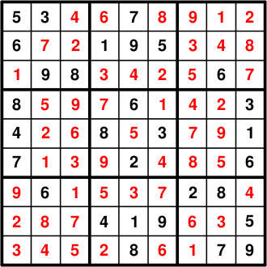

# LPとして定式化された数独問題 (A Sudoku Problem formulated as an LP)

## 問題の記述 (Problem Description)

数独 (sudoku) 問題は、不完全な 9x9 の数字の表をいくつかのルールに従って満たす必要がある問題です：

- 9つある個別の 3x3 の枠 (box) のそれぞれについて、1 から 9 までの各数字が含まれていなければならない。
- 9x9 のグリッドのどの列 (column) についても、1 から 9 までの各数字が含まれていなければならない。
- 9x9 のグリッドのどの行 (row) についても、1 から 9 までの各数字が含まれていなければならない。

このページでは、PythonのPuLPを用いて以下の問題（Wikipediaより引用）をモデルとして定式化します。一度作成すれば、わずかな修正で任意の数独問題を解くことができるようになります。


## 定式化 (Formulation)

### 決定変数の特定 (Identify the Decision Variables)

この問題を線形計画問題として定式化するために、81個のマスそれぞれに対して、そのマスに入る1から9の値を表す変数を作成するというシンプルな方法を思いつくかもしれません。しかし、これは非常に複雑になります。なぜなら線形計画法には「等しくない (not equal to)」という演算子がないため、同じ枠/行/列内にあるマス同士の値が等しくないという必要な制約を（そのままでは）使用できないからです。
枠/行/列内のすべての値の和が45になるように設計することは可能ですが、それだけだと「合計は45になるが、同じ枠/行/列の中に同じ数字が2つ入り得る」という条件を満たす解が多数存在してしまいます。
これらを解消するためにBig Mの制約を用いて、枠/列/行内のすべての値のペアに対してどちらかが絶対的に小さいことを比較する方法もありますが、ここではずっと洗練されたアプローチを紹介します：

私たちは代わりとして、729個の個別のバイナリ（0か1をとる）変数を作成します。これは、81個のマスそれぞれについて、そのマスに入る可能性のある数字（1〜9）に対応する9つの問題変数をもたせるというアプローチです。変数がバイナリであるということは、そのマスにその数字が存在するかどうか（真(1)か偽(0)か）を示します。
あるマスには数字を1つだけしか配置することができないため、各マスの9つの変数のうち、真 (1) になる変数は明らかに1つだけです。残りの8つは必ず偽 (0) にならなければなりません。この点は以下の説明でより明確になります。

### 目的関数の定式化 (Formulate the Objective Function)

興味深いことに、数独ではどの解も完全に制約を満たさなければならないため、「別の解よりも優れている解」という概念が存在しません。したがって、何かを最小化または最大化しようとしているわけではなく、単に制約を満たす変数の値を見つけようとしているだけです。結果として、今回は `LpMinimize` も `LpMaximize` も設定せず、目的関数自体を定義しません。

### 制約条件の定式化 (Formulate the Constraints)

これらは単純に数独問題における既知の制約に加え、問題の特性を表現するために新規で作成した変数へ課す制約条件となります。

1. どの行のマスに含まれる値も、それぞれ 1 から 9 でなければならない。
2. どの列のマスに含まれる値も、それぞれ 1 から 9 でなければならない。
3. どの枠 (box) のマスに含まれる値も、それぞれ 1 から 9 でなければならない。(枠とは、全体である 9x9 のグリッド内に重ならずに存在する9つの 3x3 グリッドのいずれかを指します)
4. どのマスの中にも数字は1つだけしか入ってはいけない (論理的には当たり前に思えますが、変数の選択上、私たちの定式化において保証することが非常に重要です)。
5. 初期状態で入力されている数独の数字は、最終的な解においても同じ場所になければならない (実際の数独問題ではこれらの数字は変更不可能ですが、それ以外の数字は操作可能であるため、これは制約条件となります。初期の数字が存在しない、または極端に少ない場合、数独問題には唯一の解ではなく多数の実行可能解が存在することになります)。

## 解法 (Solution)

導入のコメントとインポート文を入力します。

```python
"""
The Sudoku Problem Formulation for the PuLP Modeller

Authors: Antony Phillips, Dr Stuart Mitchell
edited by Nathan Sudermann-Merx
"""

# PuLPモデラー関数をインポートする
from pulp import *
```

数独問題の特有なケースとして、行 (row) の名前、列 (column) の名前、そして変数の取り得る値の選択肢はすべて「1 から 9 までのまったく同じ数字のリスト」となります。

```python
# 数独のすべての行、列、および値は1から9までの値を取る
VALS = ROWS = COLS = range(1, 10)
```

`Boxes` と呼ばれるリストには9つの要素が作成され、それぞれがさらにリストになっています。これら9つのリストは9つの枠それぞれに対応し、各リストはその枠内の各マスの行・列のインデックスを表すタプルを要素として含みます。次のような方法で同様の値を明示的に入力することも可能ですが、時間の無駄になってしまいます。

```python
# 各箱の各マスの行と列のインデックスを含む boxes リストが作成される
Boxes = [
    [(3 * i + k + 1, 3 * j + l + 1) for k in range(3) for l in range(3)]
    for i in range(3)
    for j in range(3)
]
```

これによって、 `Boxes[0]` を呼び出すと最初の枠に含まれる 9つのマスの場所を含んだタプルのリストが返されるようになります。

問題データを格納するために `prob` 変数を作成します。

```python
# 問題のデータを格納する prob 変数が作成される
prob = LpProblem("Sudoku Problem")
```

`(VALS, ROWS, COLS)` によって値、行、列のすべての組み合わせに対して変数が作成されるため、結果として729個の問題変数が作成されます。変数の例として `Choice_4_2_9` を挙げると、これは二値変数 (バイナリ変数。整数 1 または 0 のみを取れる性質) として定義されます。もし `Choice_4_2_9` が 1 であれば、行 2、列 9 のマスに数字の 4 が存在することを意味します。（もし 0 ならば、そこに 4 はないという意味になります。）

```python
# 決定変数が作成される
choices = prob.add_variable_dict("Choice", (VALS, ROWS, COLS), 0, 1, LpBinary)
```

上で説明したように、制約を満たす変数の組み合わせが見つかればそれで構わないため、目的関数は定義しません。

```python
# 必要ないため目的関数は定義しない
```

一つのマスにつき9つの変数が存在するため、そのうち1つだけが正確に 1 の値（そして残りは 0）を取ることを指定するのは重要です。そのために下記のコードは次のように読み取れます。すなわち、81個あるマスのそれぞれについて、その特定のマスに関連するすべての9つの変数（それぞれが存在し得る値の1〜9を表す）の合計は 1 にならなければなりません。

```python
# 各マスに1つの値しか入らないことを保証する制約を追加する
for r in ROWS:
    for c in COLS:
        prob += lpSum([choices[v, r, c] for v in VALS]) == 1
```

以下の制約は各数字 (値) が各々の行、列、枠内に1回ずつしか現れないことを保証します。

```python
# 各値に対して行、列、および箱の制約が追加される
for v in VALS:
    for r in ROWS:
        prob += lpSum([choices[v, r, c] for c in COLS]) == 1

    for c in COLS:
        prob += lpSum([choices[v, r, c] for r in ROWS]) == 1

    for b in Boxes:
        prob += lpSum([choices[v, r, c] for (r, c) in b]) == 1
```

初期数字の制約が入力されます。例えば行 1 列 1 にある 5 は真です。

```python
# 開始時の数字が制約として入力される
input_data = [
    (5, 1, 1),
    (6, 2, 1),
    (8, 4, 1),
    (4, 5, 1),
    (7, 6, 1),
    (3, 1, 2),
    (9, 3, 2),
    (6, 7, 2),
    (8, 3, 3),
    (1, 2, 4),
    (8, 5, 4),
    (4, 8, 4),
    (7, 1, 5),
    (9, 2, 5),
    (6, 4, 5),
    (2, 6, 5),
    (1, 8, 5),
    (8, 9, 5),
    (5, 2, 6),
    (3, 5, 6),
    (9, 8, 6),
    (2, 7, 7),
    (6, 3, 8),
    (8, 7, 8),
    (7, 9, 8),
    (3, 4, 9),
    (1, 5, 9),
    (6, 6, 9),
    (5, 8, 9),
]

for v, r, c in input_data:
    prob += choices[v, r, c] == 1
```

この問題は LP ファイルへ書き出され、PuLP が選んだソルバーを使って解かれ、解のステータスが画面に出力されます。

```python
# 問題のデータが.lpファイルに書き出される
prob.writeLP("Sudoku.lp")

# PuLPのデフォルトソルバーを用いて問題が解かれる
prob.solve()

# 解のステータスが画面に出力される
print("Status:", LpStatus[prob.status])
```

729個のバイナリ問題変数とそのそれぞれに対する値をすべて出力する代わりに、解をある種のテキストファイルとして描画した方が意味のある解になります。以下のコードでは、解をより読みやすくするために3番目の行と列ごとに線を挿入します。 `sudokuout.txt` は `.py` ファイルと同じフォルダに作成されます。

```python
# 書き込み用の sudokuout.txt ファイルが作成/上書きされる
sudokuout = open("sudokuout.txt", "w")

# 解が sudokuout.txt ファイルに書き込まれる
for r in ROWS:
    if r in [1, 4, 7]:
        sudokuout.write("+-------+-------+-------+\n")
    for c in COLS:
        for v in VALS:
            if value(choices[v, r, c]) == 1:
                if c in [1, 4, 7]:
                    sudokuout.write("| ")
                sudokuout.write(str(v) + " ")
                if c == 9:
                    sudokuout.write("|\n")
sudokuout.write("+-------+-------+-------+")
sudokuout.close()
```

解が保存された場所に関するメモがユーザに提示されます。

```python
# ユーザーに解の保存場所が提示される
print("Solution Written to sudokuout.txt")
```

上記の解説すべてを含んだ完全なファイルは `Sudoku1.py` に用意されています。最終的な解は以下のようになるはずです。



## エキスパート向けの追加情報 (Extra for Experts)

上記の定式化において、数独問題がうまく定義されていない場合に、解が複数存在する可能性があるいう事実までは考慮していませんでした。

`prob.writeLP` の行以降のコードを次のように編集することで、すべての解を返すようにコードを組み立てることができます。基本的には解の算出処理（solve のステートメント）をループさせるだけのものであり、解の探索が成功した後は毎回、「同じ解は二度と使用できない」という制約を追加します。解が尽きて出なくなった時、プログラムは終了します。

```python
while True:
    prob.solve()
    # 解のステータスが画面に出力される
    print("Status:", LpStatus[prob.status])
    # 制約を満たし、「最適」とみなされた場合、解が出力される
    if LpStatus[prob.status] == "Optimal":
        # 解が sudokuout.txt ファイルに書き込まれる
        for r in ROWS:
            if r in [1, 4, 7]:
                sudokuout.write("+-------+-------+-------+\n")
            for c in COLS:
                for v in VALS:
                    if value(choices[v, r, c]) == 1:
                        if c in [1, 4, 7]:
                            sudokuout.write("| ")
                        sudokuout.write(str(v) + " ")
                        if c == 9:
                            sudokuout.write("|\n")
        sudokuout.write("+-------+-------+-------+\n\n")
        # 同じ解が再び見つからないようにする制約を追加する
        prob += (
            lpSum(
                [
                    choices[v, r, c]
                    for v in VALS
                    for r in ROWS
                    for c in COLS
                    if value(choices[v, r, c]) == 1
                ]
            )
            <= 80
        )
    # 新しい最適解が見つからない場合、プログラムを終了する
    else:
        break
sudokuout.close()
```

以上を使用した完全なファイルは `Sudoku2.py` に記述されています。このコードを膨大な数の解を持つ数独の解答に使用した場合、すべての解を提示しきるまでに非常に長い時間がかかることがあります。ユニーク解（唯一の解）を持つ数独問題から、複数を解に持つ数独の問題を作るには、開始時の数字の制約条件を単に削除するだけで行うことができます。試しにいくつかの制約を削除しても依然としてただ一つの最適解が得られたりしますが、ある特定の制約を1つ削除しただけで、突然劇的な解の数の増加をもたらしたりすることがあることに気がつくでしょう。
