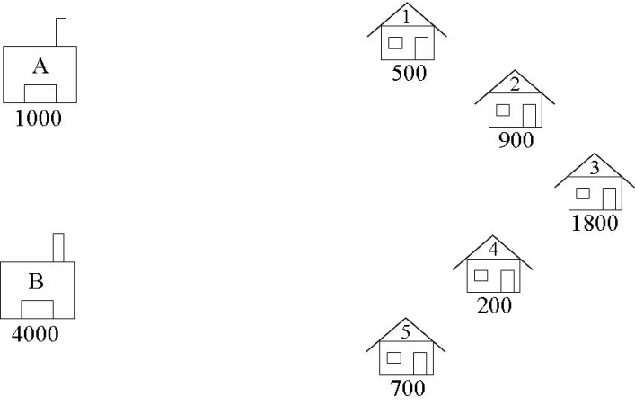
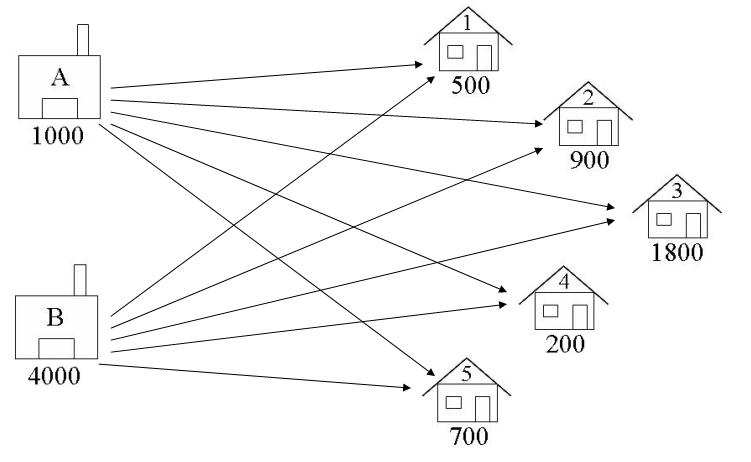
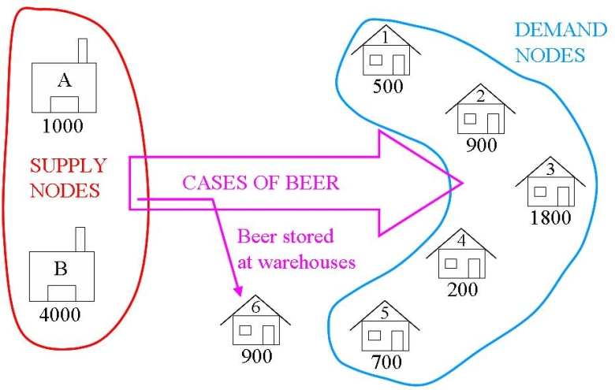
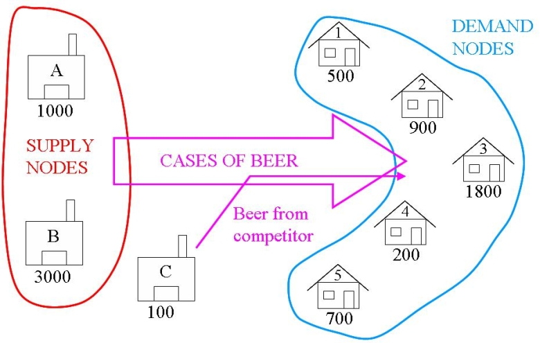

# 輸送問題 (A Transportation Problem)

## 問題の記述 (Problem Description)

ある小規模なビール醸造所（ブルワリー）には2つの倉庫があり、そこから厳選された5つのバーへビールを配送しています。毎週初めに各バーはブルワリーの本社へ特定のケース数のビールを注文し、その後、適切な倉庫からそのバーへ発送されます。ブルワリーは全体の運用コストを最小化するために、どの倉庫からどのバーへ供給すべきかを毎週教えてくれるインタラクティブなコンピュータプログラムを作成したいと考えています。例えば、ある週の初めにブルワリーの倉庫Aに1000ケース、倉庫Bに4000ケースがあり、バーがそれぞれ500、900、1800、200、700ケースを必要としていると仮定します。どの倉庫がどのバーに供給すべきでしょうか？

## 定式化 (Formulation)

輸送問題において、定式化の際に問題をグラフィカルに表現することはしばしば役立ちます。以下は「ビール配送問題 (The Beer Distribution Problem)」のグラフィカルな表現です。



### 決定変数の特定 (Identify the Decision Variables)

輸送問題では、供給ノードから需要ノードへの商品の輸送方法を決定します。決定変数は、以下の図に示されるようにノードを繋ぐ「弧 (Arcs)」です。私たちは各倉庫から各バーへ何ケースのビールを輸送するかを決定しようとしています。



- A1 = 倉庫Aからバー1へ輸送するビールのケース数
- A5 = 倉庫Aからバー5へ輸送するビールのケース数
- B1 = 倉庫Bからバー1へ輸送するビールのケース数
- B5 = 倉庫Bからバー5へ輸送するビールのケース数

以下のように定義します：
$$ W = \{A, B\} $$
$$ B = \{1, 2, 3, 4, 5\} $$
$$ x_{(w,b)} \ge 0 \dots \forall w \in W, b \in B $$
$$ x_{(w,b)} \in \mathbb{Z}^+ \dots \forall w \in W, b \in B $$

変数の下限は 0 であり、すべての値は整数でなければなりません（ケース数がマイナスになったり、分数になったりすることはできないためです）。上限はありません。

### 目的関数の定式化 (Formulate the Objective Function)

目的関数はコストとして大まかに定義されています。倉庫からバーへの輸送コストが、輸送されるケース数の線形関数である場合にのみ、この問題を線形計画法として定式化することができます。常にそうとは限らないことに注意してください。これは規模の経済や固定コストなどの要因によるものです。例えば、あるトラックが1ケース運ぶのも10ケース運ぶのも同じように容易であれば、10ケース運ぶコストは1ケース運ぶコストの10倍にはならないかもしれません。通常このような状況ではトラックの運行に固定コストがあり、（追加のトラックが必要になる段階で）コストが跳ね上がることを意味します。そのような状況では、0-1整数変数を使用してコストをモデル化することが可能です（このコースの後半で取り上げます）。

ここでは、ケースあたりの輸送コストが固定であると仮定しましょう（輸送しなければならないケース数に対してトラックの容量が小さい場合、これは妥当な仮定です）。ここでは財務担当マネージャーから以下の輸送コスト（単位：ケースあたりドル）が提示されたと仮定します：

| 倉庫からバーへ | 1 | 2 | 3 | 4 | 5 |
| :---: | :---: | :---: | :---: | :---: | :---: |
| **A** | 2 | 4 | 5 | 2 | 1 |
| **B** | 3 | 1 | 3 | 2 | 3 |

最小化する輸送コスト = 
ルートA1のケースあたりのコスト * A1 (ルートA1上のケース数) 
+ … + ルートB5のケースあたりのコスト * B5 (ルートB5上のケース数)

$$ \min \sum_{w \in W, b \in B} c_{(w,b)} x_{(w,b)} $$

### 制約条件の定式化 (Formulate the Constraints)

制約条件は、供給と需要を考慮することで得られます。倉庫Aでのビールの供給量は1000ケースです。倉庫Aから出荷されるビールの合計量がこの量を超えることはできません。同様に、倉庫Bから出荷されるビールの量が倉庫Bでの供給量を超えることはできません。ある倉庫から出るすべての弧の値の合計は、その倉庫の供給量以下でなければなりません：

したがって：
A1 + A2 + A3 + A4 + A5 <= 1000
B1 + B2 + B3 + B4 + B5 <= 4000

$$ \sum_{b \in B} x_{(w,b)} \le s_w \dots \forall w \in W $$

バー1におけるビールの需要は500ケースなので、販売機会の損失を避けるためにそこに配達されるビールの量は少なくとも500ケースでなければなりません。同様に、他のバーに配達される量もそれらのバーでの需要以上である必要があります。ここでは、（追加の輸送コストがかかること以外は）バーに過剰に供給することによるペナルティはないと仮定しています。また、需要が正確に満たされるように輸送問題をバランスさせることができます（詳細は後述）。現在のところ、あるバーに入るすべての弧の値の合計は、そのバーの需要量以上でなければなりません：

A1 + B1 >= 500
A2 + B2 >= 900
A3 + B3 >= 1800
A4 + B4 >= 200
A5 + B5 >= 700

$$ \sum_{w \in W} x_{(w,b)} \ge d_b \dots \forall b \in B $$

最後に、出荷されるビールの量が非負でなければならないことは既に指定済みです。

## PuLP モデル (PuLP Model)

上記で定義された線形計画（LP）は、「混合問題（Whiskas）」と同じ方法でPythonコードとして定式化できますが、輸送問題においてはより効率的な方法があり、このコースではそれを使用します。この問題のサンプルファイルは `examples` ディレクトリの `BeerDistributionProblem.py` にあります。

まず、Pythonファイルの先頭に見出しと PuLP のインポート文を記述して始めます：

```python
"""
The Beer Distribution Problem for the PuLP Modeller

Authors: Antony Phillips, Dr Stuart Mitchell  2007
"""

# PuLPモデラー関数をインポート
from pulp import *
```

定式化の初めは、ノードとその制限/容量の簡単な定義です。ノード名はリストに入れられ、関連する容量はノード名を参照キーとする辞書に入れられます：

```python
# すべての供給ノードのリストを作成
Warehouses = ["A", "B"]

# 各供給ノードの供給ユニット数用の辞書を作成
supply = {"A": 1000, "B": 4000}

# すべての需要ノードのリストを作成
Bars = ["1", "2", "3", "4", "5"]

# 各需要ノードの需要ユニット数用の辞書を作成
demand = {
    "1": 500,
    "2": 900,
    "3": 1800,
    "4": 200,
    "5": 700,
}
```

その後、コストデータが2つのサブリストをもつリスト力されます。1つ目は倉庫Aからの輸送コスト、2つ目は倉庫Bからの輸送コストを含んでいます。コメントやコードの構造によって、データが後の編集を容易にするために表のように見えるようにされていることに注目してください。
WarehouseとBarsのリスト（供給ノードと需要ノード）は合わせて1つの大きなリスト（全ノードが含まれる）となり、PuLPの `makeDict` 関数に渡されます。2番目のパラメータは先ほど作成したコストリストであり、最後のパラメータは弧（arc）コストのデフォルト値を設定します。このコスト辞書が作成された後、例えば `costs["A"]["1"]` を呼び出すと、倉庫Aからバー1へ輸送するコストである 2 が返されます。`costs["C"]["2"]` を呼び出すと、デフォルト値として定義されている 0 が返されます。

```python
# 各輸送経路のコストのリストを作成
costs = [  # Bars
    # 1 2 3 4 5
    [2, 4, 5, 2, 1],  # A   Warehouses
    [3, 1, 3, 2, 3],  # B
]

# コストデータを辞書化する
costs_dict = makeDict([Warehouses, Bars], costs, 0)
```

`prob` 変数は通常の入力パラメータともに `LpProblem` 関数を使用して作成されます。

```python
# 問題データを含めるための 'prob' 変数を作成
prob = LpProblem("Beer Distribution Problem", LpMinimize)
```

すべての弧を含んだタプルのリストを作成します。

```python
# 輸送可能なすべてのルートを含んだタプルのリストを作成
Routes = [(w, b) for w in Warehouses for b in Bars]
```

LPの変数を含んだ `vars` という辞書が構築されます。この辞書の参照キーは、倉庫の名前、そしてバーの名前（`["A"]["2"]`）であり、データは `Route_Tuple`（例: `["A"]["2"]`: `Route_A_2`）となります。下限としてゼロ、上限としてNone、そして整数（Integer）として変数が定義されます。

```python
# 参照変数（ルート）を含むための 'vars' という辞書を作成
vars = prob.add_variable_dict("Route", (Warehouses, Bars), 0, None, LpInteger)
```

目的関数はリスト内包表記を使用して `prob` 変数に追加されます。`vars` と `costs` は現在（さらに内部辞書を持つ）辞書であるため、まるで表であるかのように使用でき、`for (w,b) in Routes` によってすべての組み合わせ/弧を循環します。`i` や `j` としてもよかったのですが、`w` や `b` を用いた方がより意味が分かりやすいことに注目してください。

```python
# まず目的関数を 'prob' に追加する
prob += (
    lpSum([vars[w, b] * costs_dict[w][b] for (w, b) in Routes]),
    "Sum_of_Transporting_Costs",
)
```

供給と需要の制約は、通常のforループとリスト内包表記を用いて追加されます。
**供給制約**： 各倉庫について順番に、すべてのバーへの決定変数の値（弧上のビールのケース数）を合算し、その合計がその倉庫の供給上限以下になるよう制約されます。
**需要制約**： 各バーについて順番に、すべての倉庫からの決定変数の値（弧上の数）を合算し、その合計が需要の下限以上になるよう制約されます。

```python
# 各供給ノード（倉庫）に対する供給最大制約をprobに追加
for w in Warehouses:
    prob += (
        lpSum([vars[w, b] for b in Bars]) <= supply[w],
        f"Sum_of_Products_out_of_Warehouse_{w}",
    )

# 各需要ノード（バー）に対する需要最低制約をprobに追加
for b in Bars:
    prob += (
        lpSum([vars[w, b] for w in Warehouses]) >= demand[b],
        f"Sum_of_Products_into_Bar{b}",
    )
```

これに続いて `prob.writeLP` の行があり、残りは以前の例で説明した通りです。

この例のコードは `BeerDistributionProblem.py` にあります。

線形計画法の解が整数の解でもあることにお気付きでしょう。供給と需要が整数である限り、線形計画法の解は常に整数になります。詳細については「自然に整数になる解 (naturally integer solutions)」を参照してください。

## 拡張 (Extensions)

### 検証 (Validation)

「供給と需要が整数であることを保証したため、線形計画法の解も整数になることがわかっている」ので、解の整数性をいちいちチェックする必要はありません。

### 保管と「買い付け」 (Storage and “Buying In”)

輸送モデルは通常「バランスが取れて」います。つまり、総供給量 = 総需要量です。これは、超過した供給量は通常どこかに保管されなくてはならず（保管コストが伴う）、超過した需要量は通常他の供給源から追加の商品を購入する（これを「買い付け (buying in)」と呼びます）か、別の製品で代用する（ペナルティコストが発生します）ことで満たされるためです。

今回のビール配送問題では、総供給量はビール5000ケースに対して、総需要量はわずか4100ケースです。超過した供給量はダミー需要ノード（dummy demand node）へ送ることができます。ダミー需要ノードへ向かうフローのコストは、各供給ノードにおける保管コストになります。



これは上記のモデルに非常に単に追加できます。目的関数と制約は全て元の供給、需要、およびコストリスト/辞書を利用して操作されるため、もう一つの需要ノードを含めるために行う唯一の変更は次の通りです：

```python
# 各供給ノードの供給ユニット数用の辞書を作成
supply = {"A": 1000, "B": 4000}

# すべての需要ノードのリストを作成
Bars = ["1", "2", "3", "4", "5", "D"]

# 各需要ノードの需要ユニット数用の辞書を作成
demand = {"1": 500, "2": 900, "3": 1800, "4": 200, "5": 700, "D": 900}

# 各輸送経路のコストのリストを作成
costs = [  # Bars
    # 1 2 3 4 5 D
    [2, 4, 5, 2, 1, 0],  # A   Warehouses
    [3, 1, 3, 2, 3, 0],  # B
]
```

問題のバランスをとるため、Barsリストが拡張され、Demand辞書は「Dummy Demand (D)」が900ケースを必要とするように拡張されます。コストリストも拡張され、「ダミーノードへ送る」費用の列（実際には倉庫に在庫を残すこと）が加わります。ここにはゼロではなく、倉庫保管に伴う金額を追加することもできます。なお、非平衡な過剰供給の時であっても解は計算できた点に注意してください。

もし輸送モデルにおいて供給よりも需要が多い場合、ダミーの供給ノードを使用して問題のバランスをとることもできます。超過需要がある状態で非平衡のままだと、問題が「実行不可能 (Infeasible)」となることに注意してください。

生産上の問題があり、ビールのケースが4000しか生産できなかったと仮定しましょう。総需要は4100であるため、ダミーの供給ノードから不足しているビールのケースを調達する必要があります。

この例のコードは `BeerDistributionProblemWarehouseExtension.py` にあります。



このダミー供給ノードは、単純かつ論理的にWarehouseリスト、Supply辞書、およびコストのリストにそれぞれ追加されます。供給値は問題のバランスを取るように選択され、すべての需要ノードへの輸送コストはゼロとします。

```python
# すべての供給ノードのリストを作成
Warehouses = ["A", "B", "C"]

# 各供給ノードの供給ユニット数用の辞書を作成
supply = {"A": 1000, "B": 4000, "C": 100}

# すべての需要ノードのリストを作成
Bars = ["1", "2", "3", "4", "5"]

# 各需要ノードの需要ユニット数用の辞書を作成
demand = {
    "1": 500,
    "2": 900,
    "3": 1800,
    "4": 200,
    "5": 700,
}

# 各輸送経路のコストのリストを作成
costs = [  # Bars
    # 1 2 3 4 5
    [2, 4, 5, 2, 1],  # A   Warehouses
    [3, 1, 3, 2, 3],  # B
    [0, 0, 0, 0, 0],  # C
]
```

この例のコードは `BeerDistributionProblemCompetitorExtension.py` にあります。

## 解の提示と分析 (Presentation of Solution and Analysis)

ビール配送問題の解の提示方法にはさまざまな方法があります。配送のリスト形式や、テーブル形式などです。

```text
TRANSPORTATION SOLUTION -- Non-zero shipments
TotalCost = ____

Ship ___ crates of beer from warehouse A to pub 1
Ship ___ crates of beer from warehouse A to pub 5
Ship ___ crates of beer from warehouse B to pub 1
Ship ___ crates of beer from warehouse B to pub 2
Ship ___ crates of beer from warehouse B to pub 3
Ship ___ crates of beer from warehouse B to pub 4
```

この情報をもとに、経営陣に向けた以下のようなサマリーを作成できます：

```text
The Beer Distribution Problem
Mike O'Sullivan, 1234567

私たちは醸造所運営における輸送コストを最小化しようとしています。ブルワリーは
倉庫からいくつかのバーへビールのケースを輸送しています。

ブルワリーには2つの倉庫（それぞれAとB）と5つのバー（1, 2, 3, 4, 5）があります。

各倉庫におけるビールの供給量は以下の通りです：
__________

各バーでの予想需要（ビールのケース数）は以下の通りです：
__________

1ケースのビールを倉庫からバーへ輸送するコストは以下の表の通りです：
__________

輸送コストを最小化するために、ブルワリーは以下の配送を行うべきです：

Ship ___ crates of beer from warehouse A to pub 1
Ship ___ crates of beer from warehouse A to pub 5
Ship ___ crates of beer from warehouse B to pub 1
Ship ___ crates of beer from warehouse B to pub 2
Ship ___ crates of beer from warehouse B to pub 3
Ship ___ crates of beer from warehouse B to pub 4

この輸送計画による合計輸送コストは $_____ となります。
```

## 継続的なモニタリング (Ongoing Monitoring)

継続的なモニタリングは、以下のような形で行うことができます：

- データの変更（コスト、供給、需要の変更）に合わせてデータファイルを更新し、再解決すること。
- 新しいノード（例：新しい倉庫やバー）に合わせてモデルを再解決すること。
- 輸送コストが最適解に影響を与えるルートにおいて、より安い選択肢が利用できないかどうかを調べること（例：倉庫Bからバー1への輸送費を削減することで、合計でどれだけ節約できるか等）。
